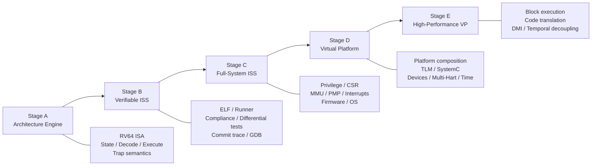
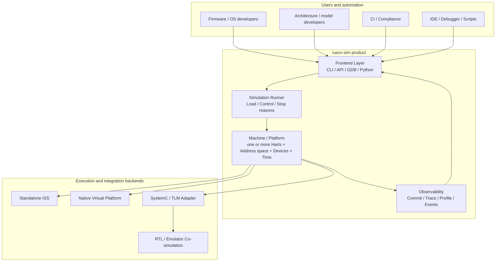
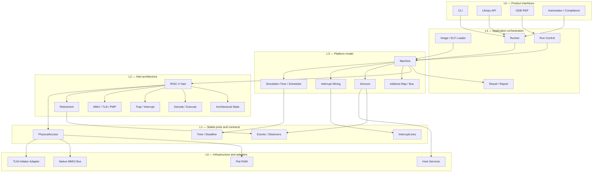
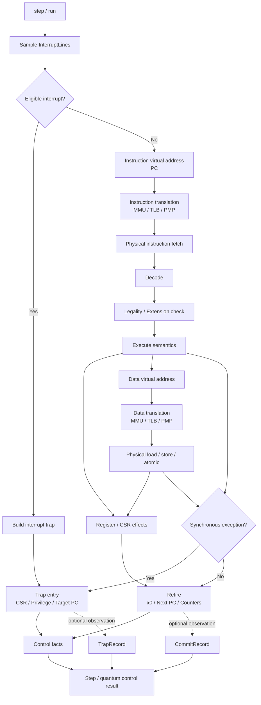
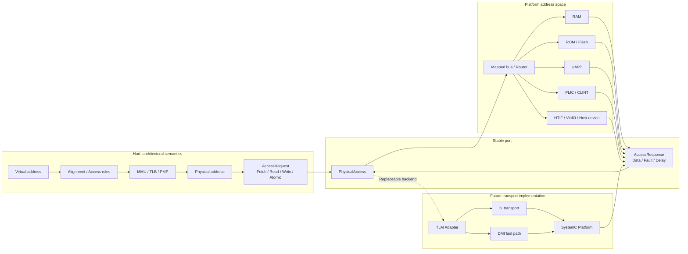
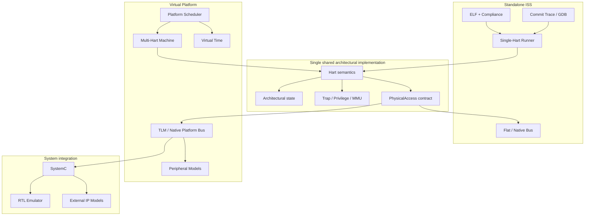
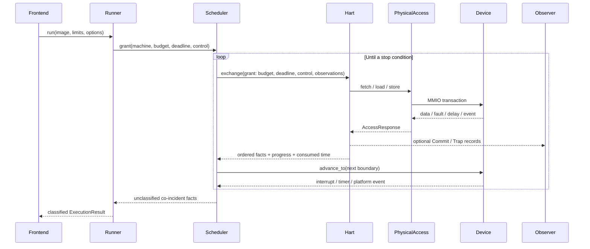
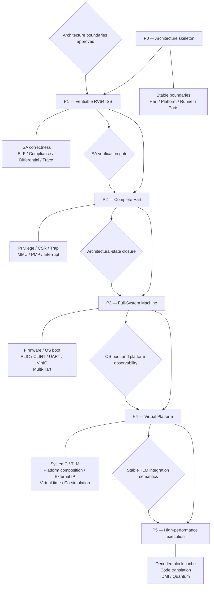

# ruscv-sim: ISS → Virtual Platform Architecture

**Status:** Current target architecture

**Authority:** Normative for product boundaries; not an implementation-status claim

**Established:** 2026-08-26

**Scope:** Product direction, ownership boundaries, dependency direction, and capability evolution

This document describes the intended product architecture. It does not claim that every depicted component is implemented or integrated. Current capability must be established from the source code and verified tests.

For the corresponding as-is execution path, component wiring, and Current → Target gaps, see [Current Implementation Architecture](current-state.md).

## 1. Product evolution

## 2. Product system context

## 3. Logical layers and dependency direction

## 4. Hart internal architecture

## 5. Address, memory, and TLM boundary

## 6. One execution engine, multiple product forms

A Machine is one Platform plus one or more Harts; N=1 is the ISS baseline. Native VP scheduling is Machine-associated. SystemC, HDL, or other co-simulation may own the outer execution thread while the same Hart/Platform semantics and ruscv-sim result taxonomy remain in force.

## 7. Runtime control, time, and events

This sequence is the Runner-driven ISS/native path. [ADR-0004](decisions/0004-interrupt-time-scheduling-and-stop-boundaries.md) defines the exchange, pre-fetch interrupt sample, modeled-time and delay accounting, WFI/idle boundary, and fact ordering shown here. In external-kernel hosting the kernel grants time into the Machine; the Runner still classifies non-lossy facts and does not have to own that outer thread. Observation records are subscriber-gated; control facts are always returned.

## 8. Capability accumulation and architecture gates

