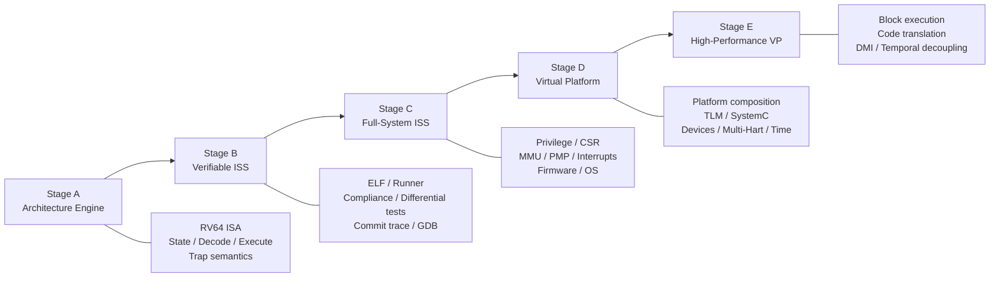
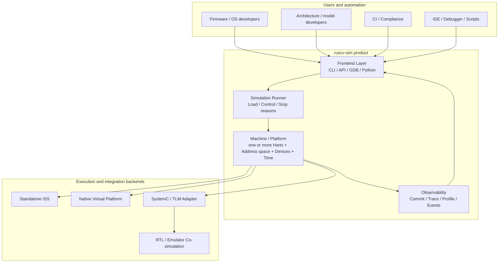
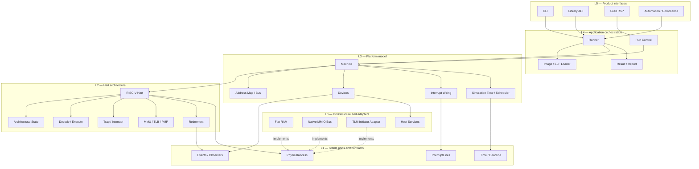
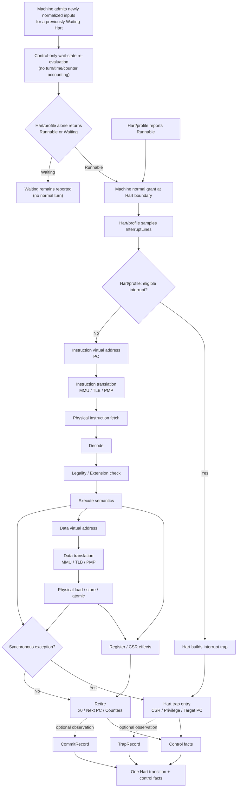
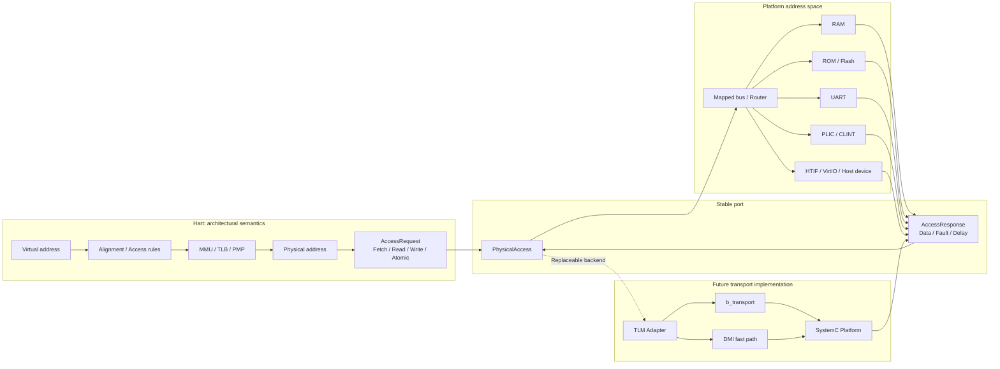
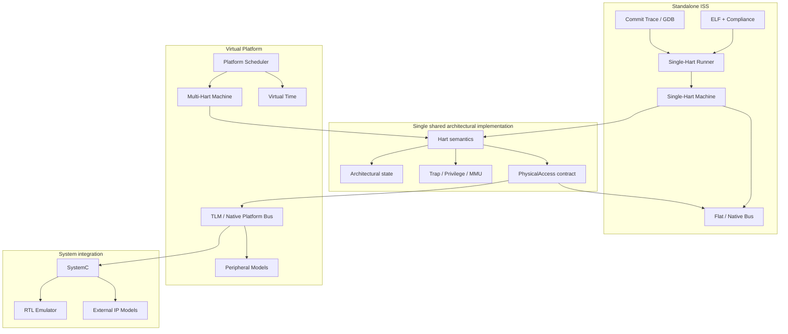
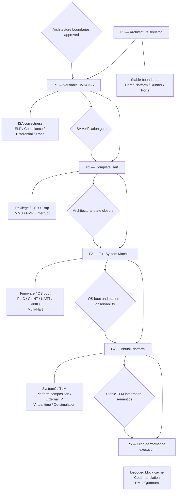

# ruscv-sim: ISS → Virtual Platform Architecture

**Status:** Current target architecture

**Authority:** Normative for product boundaries; not an implementation-status claim

**Established:** 2026-08-26

**Scope:** Product direction, ownership boundaries, dependency direction, and capability evolution

This document describes the intended product architecture. It does not claim that every depicted component is implemented or integrated. Current capability must be established from the source code and verified tests.

For the corresponding as-is execution path, component wiring, and Current → Target gaps, see [Current Implementation Architecture](current-state.md).

## 1. Product evolution



## 2. Product system context



## 3. Logical layers and dependency direction



Solid arrows in this view denote dependencies; dotted `implements` arrows point
from concrete backends to their semantic port. Machine returns control facts to
Runner, but does not depend on Runner's report/result types. Runner invokes the
loader for image metadata and asks Machine to install it; Platform performs the
physical writes. The loader has no Machine dependency. This follows the accepted
[ADR-0003 §4](decisions/0003-runner-machine-and-platform-ownership.md#4-elf-parsing-image-placement-and-address-meaning)
and the principles' metadata/installation split.

## 4. Hart internal architecture



## 5. Address, memory, and TLM boundary



## 6. One execution engine, multiple product forms



A Machine is one Platform plus one or more Harts; N=1 is the ISS baseline. Native VP scheduling is Machine-associated. SystemC, HDL, or other co-simulation may own the outer execution thread while the same Hart/Platform semantics and ruscv-sim result taxonomy remain in force.

## 7. Runtime control, time, and events

```mermaid
sequenceDiagram
    participant F as Frontend
    participant R as Runner
    participant M as Machine
    participant H as Hart
    participant B as PhysicalAccess
    participant D as Device
    participant O as Observer

    F->>R: run(image, limits, options)
    loop Until Runner classifies a terminal result
        R->>M: grant(budget, deadline, control, observations)
        loop Until a required Machine return boundary
            M->>M: admit due Platform/input events at cursor
            opt Continue/run with newly admitted input for a previously Waiting Hart
                M->>H: control-only wait-state re-evaluation (no turn/accounting)
                H-->>M: Runnable or Waiting (Hart/profile-owned result)
            end
            M->>M: evaluate all boundary facts and completion safety
            alt Runnable and budget/deadline/control conditions permit
                M->>H: Hart-provided architectural boundary + admitted inputs
                H->>H: profile decides eligibility
                alt Hart/profile accepts interrupt before fetch
                    H->>H: enter trap; no instruction fetch or retirement
                else No interrupt accepted; attempt instruction
                    H->>B: instruction fetch
                    B-->>H: raw bytes / fault / failure / delay
                    opt Fetch and checks permit an instruction data access
                        H->>B: load / store / atomic
                        opt Physical target is MMIO
                            B->>D: transaction
                            D-->>B: target result; retain causal Platform event
                        end
                        B-->>H: AccessResponse
                    end
                    H->>H: complete retirement, synchronous trap, or failure
                end
                H-->>M: outcome + state/counter facts + optional records
                M->>M: consume known delay once; account completed turns; admit causal events
            else Legal continue/run idle advance with budget and time remaining
                M->>M: jump to next event or deadline; repeat admission/re-evaluation
            else Stop, limit, waiting single-step, or no admissible progress
                M->>M: retain all applicable facts; start no work or idle jump
            end
            opt Subscribed observations ready at a completed boundary
                M-->>R: immutable observations for delivery
                R->>O: deliver requested observations
                O-->>R: delivery status
                R-->>M: delivery acknowledgment or observer-failure fact
            end
            M->>M: collect coincident facts; honor required return boundary
        end
        M-->>R: unclassified co-incident facts + accounting
        R->>R: select primary reason without discarding facts
    end
    R-->>F: classified ExecutionResult
```

This diagram shows the required observable phases for the Runner-driven ISS/native
path; it is not a scheduler control-flow prescription. [ADR-0004](decisions/0004-interrupt-time-scheduling-and-stop-boundaries.md)
defines input admission, the Machine's normal architectural grant and
control-only wait-state re-evaluation grant at a Hart/profile-provided boundary,
conservative deadline bounds, modeled-time and delay accounting, WFI/idle
scheduling, and fact ordering shown here. After a legal `continue`/`run` idle
jump, input admission and the required wait-state re-evaluation may occur in the
same exchange; the Hart/profile alone returns `Runnable` or `Waiting`, and only a
`Runnable` result plus permitted budget/deadline/control conditions can lead to a
normal turn. The re-evaluation consumes no turn, instruction attempt, retirement,
`iss_tick`, virtual-time advance, physical delay, or ISA counter delta. At a
reached deadline it may report state but no normal turn begins, while a Waiting
single-step retains its no-idle-jump `Waiting` + `SingleStepBoundary` behavior.
The selected Hart/profile decides interrupt eligibility, masking/delegation,
architectural priority, trap/debug/WFI transitions, and ISA-visible counter
deltas; the Machine never evaluates those predicates or changes Hart run state
directly. In external-kernel hosting the kernel grants the authoritative time
horizon into the Machine; the Runner still classifies non-lossy facts and does not
have to own that outer thread. Observation records are subscriber-gated; control
facts are always returned. The observation exchange represents Runner-owned
sink delivery at a completed boundary, not permission to re-enter Hart execution;
with observation disabled it is absent. Accepted interrupts take the no-fetch
branch. The instruction branch abbreviates translation, architectural checks and
fault handling, not an obligation to issue a data request after a failed fetch.
Idle advances require the ADR-0004 §8.3 preconditions; zero budget, an effective
stop, a reached deadline, and Waiting single-step do not advance time.

## 8. Capability accumulation and architecture gates


