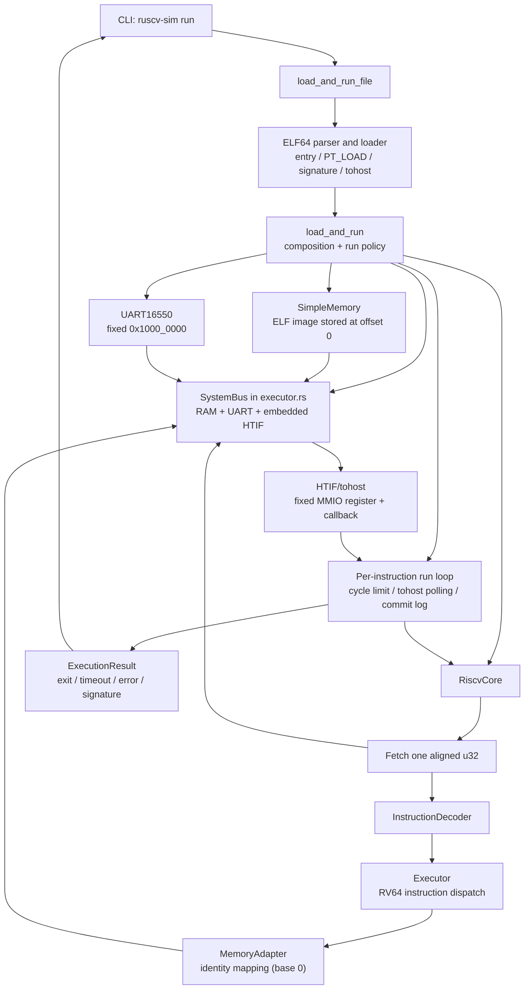
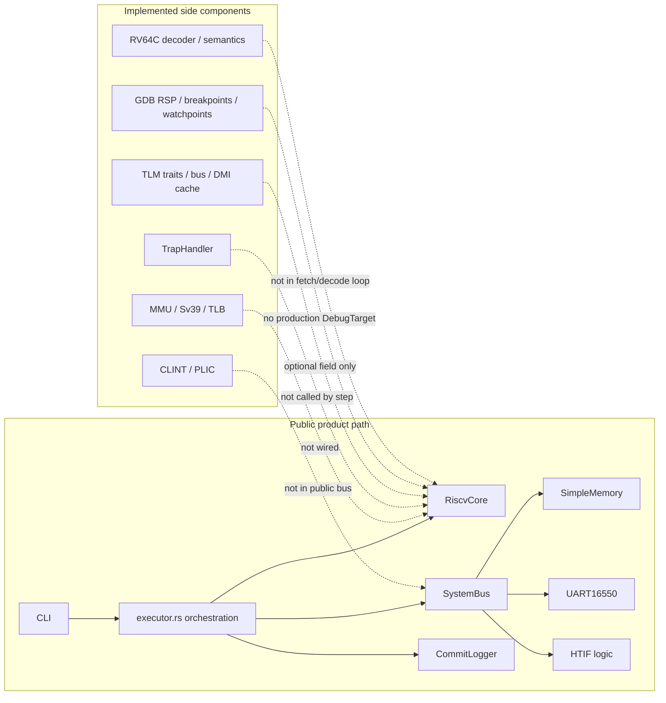

# Current Implementation Architecture

**Status:** Current implementation inventory

**Authority:** Informational

**Last verified:** 2026-09-03

**Scope:** The public ELF execution path, adjacent library APIs, and the integration status of existing ISS/VP components

This document describes what the repository implements today. It is deliberately separate from the [target architecture](./README.md): target diagrams define intended ownership, while this inventory records current wiring and boundary debt. Source code and verified tests remain authoritative for implementation claims.

## 1. How to read the status labels

| Label | Meaning |
| --- | --- |
| **Public path** | Reachable through `ruscv-sim run` and exercised as part of the ELF execution flow. |
| **Library path** | Reachable through a public Rust API, but not used by the CLI execution path. |
| **Component** | Implemented and covered by focused tests, but not wired into the public ELF path. |
| **Placeholder** | A type, field, or interface exists, but the execution path does not use it. |

These labels describe integration, not specification completeness. An instruction or subsystem may have unit tests without being verified end to end by an external architectural test suite.

## 2. Public ELF execution path

The flow is real and usable: the CLI loads an RV64 ELF, constructs RAM, UART, and the concrete bus, steps the core, observes `tohost`, optionally writes a commit log, and returns an execution result. Project-authored bare-metal ELF tests are also compiled and run in CI on non-documentation pushes to `main`.

The current composition has several important properties:

- `load_and_run` simultaneously acts as loader, machine builder, runner, stop-policy owner, result builder, and observer coordinator.
- `SystemBus` is a concrete platform type in the public `executor` module and is instantiated directly by `load_and_run`; it is not the standalone TLM bus and is not re-exported at the crate root.
- ELF memory is stored relative to its lowest load address. In `load_and_run`, `RiscvCore::reset` uses base `0`, so `MemoryAdapter` passes addresses unchanged and `SystemBus` converts RAM addresses to offsets; the alternate flat-memory library path resets with the ELF base and uses `MemoryAdapter` subtraction.
- The core fetches a 32-bit word and advances the PC by four unless execution marks a branch as taken. RV64C decoding exists separately but is not in this fetch path.
- A successful instruction returns `()`. Architectural traps, guest exits, debugger stops, execution limits, and simulator faults are therefore not represented by one structured step/run outcome model.

## 3. Current composition and ownership

This is not yet the target `Frontend → Runner → Machine → Hart/Platform → ports` dependency structure. The main boundary problem is not missing instruction code; it is that product orchestration and a minimal platform are fused while several richer components live beside, rather than behind, the active execution path.

## 4. Component integration inventory

| Area | Current implementation | Status | Evidence and limitation |
| --- | --- | --- | --- |
| CLI | One `run` command with ELF path, cycle limit, `tohost`, verbosity, and commit-log options | **Public path** | `src/main.rs` calls `load_and_run_file`; no machine/platform/debug selection exists. |
| ELF loader | ELF64 little-endian RISC-V parsing, load segments, entry point, signature, and `tohost` discovery | **Public path** | Used directly by `load_and_run`; image is flattened relative to `base_addr`. |
| Runner/orchestration | Per-instruction loop, cycle limit, HTIF polling, signature dump, result construction | **Public path** | Implemented inside `load_and_run`, not as a stable Runner abstraction. |
| Hart state and execution | PC, GPRs, privilege, CSR/FPU state, decoder, executor, instruction/data memory handles | **Public path** | `RiscvCore::step` is the active engine; step returns an unstructured error/result and does not sample platform interrupt lines. |
| Instruction fetch | One aligned 32-bit memory read per step | **Public path** | PC fall-through is fixed at `+4`; the separate RV64C implementation is not selected. |
| RV64 instruction semantics | RV64I dispatch plus M/A/F/D paths in the active executor | **Public path, coverage varies** | Presence in the dispatcher is not a claim of full extension compliance; external architectural verification has not yet established the supported profile. The decoder recognizes the FENCE major opcode as `MiscMem` but returns `DecodeError::UnimplementedInstruction`, and `Executor::execute` has no `MiscMem` arm, so FENCE has no public-path execution or ordering effect. |
| Flat memory | Thread-safe byte vector with typed aligned accesses | **Public path** | Also used directly by the alternate library simulator path. |
| Native bus | Concrete RAM/UART/HTIF routing in `executor.rs` | **Public path and library API** | `SystemBus` is public through `ruscv_sim::executor`, with fixed devices and limited access widths. Its UART route spans `0x1000_0000..0x1000_00ff` (`uart_size = 0x100`), while the exported `UART_SIZE` is 8 bytes; no reusable address-map/platform contract exists. |
| UART16550 | Register model and output callback | **Public path, limited wiring** | The public bus exposes byte accesses at `0x1000_0000` through a 0x100-byte window, but the UART model declares `UART_SIZE = 8` and a TLM range ending at `0x1000_0007`; offsets `0x08..0xff` are therefore routed by `SystemBus` outside the UART's declared range. The richer TLM target behavior is tested separately. |
| HTIF / `tohost` | Fixed write endpoint, callback, selected-address polling, exit decoding, and RAM clearing | **Public path** | The fixed `0x4000_8000` endpoint is dword-only: `read_dword` returns `0`, `write_dword` invokes the callback, and byte/halfword/word methods reject it. Separately, `load_and_run` polls the selected ELF/CLI `tohost` address with `read_dword` and invokes `clear_tohost` after a decoded signal; these are distinct mechanisms embedded in executor orchestration. |
| Commit trace | Optional per-retired-instruction record | **Public path** | Register deltas are recorded, but `mem_access` is always passed as `None`. Before `core.step`, `load_and_run` re-fetches the instruction with `pc_before.wrapping_sub(base_addr)`; because the public core is reset with base `0` and `SystemBus` expects the ELF-mapped address, a nonzero ELF base puts this refetch outside the RAM window and `unwrap_or(0)` logs opcode `0`. |
| `RiscVSimulator` wrapper | Flat-memory load/step/run API | **Library path** | It duplicates parts of `load_and_run`, does not use `SystemBus`, and has different address/device behavior. It must not become a second architecture engine. |
| Cached instruction dispatcher | `Dispatcher`, instruction-key lookup, and LRU cache | **Component** | `src/dispatch/mod.rs` defines `Dispatcher`; focused tests cover registration and cache behavior, but `RiscvCore` owns and calls `Executor` directly, so this dispatcher is not in the active execution path. |
| Code-generation experiments | Encoding templates and procedural-macro experiments | **Component / placeholder** | They are not the active decoder or executor; some macro expansions target APIs absent from the current core. See [Code-Generation Component Status](../reference/code-generation.md). |
| Trap model | Trap causes, delegation, context, and `TrapHandler` | **Component** | Focused tests exist, but `RiscvCore::step` does not invoke `TrapHandler`; execution errors currently terminate the run instead of forming a unified architectural outcome. |
| MMU / Sv39 / TLB | Sv39 page-table translation, TLB, A/D behavior, and physical-memory model; Sv48 is recognized as a mode but rejected as unsupported, while PMP configuration/error placeholders exist without checks | **Component** | Focused tests cover the Sv39 path, but no MMU is owned or called by `RiscvCore`; the public ELF path uses ELF base adaptation instead. `MmuConfig::enable_sv48` and `pmp_entries` are configuration fields, and `MmuError::PmpViolation` exists, but the translator rejects Sv48 and no PMP check is implemented in `Mmu` or `AddressTranslator`. |
| TLM | Payloads, phases, target/initiator traits, routed bus, simple memory, DMI cache | **Component** | Tested as a Rust TLM-style subsystem. The optional `RiscvCore::tlm_interface` field can be set but is not read by `step`; no SystemC/C++ adapter exists. |
| CLINT / PLIC | MMIO models, interrupt state, TLM target implementations | **Component** | Unit/integration tests compose them with `TlmBus`, but the public `SystemBus` does not map them and the Hart has no interrupt-line input. |
| Debug | GDB RSP server, debug CLI, breakpoint and watchpoint managers | **Component** | Production code defines the `DebugTarget` contract, but only mock targets implement it; the product CLI does not expose a debug mode. |
| Platform time | TLM-style `ScTime` and CLINT time functions | **Component** | The public run loop equates one completed instruction with one cycle and has no scheduler/device advancement contract. |

## 5. Current → Target gap matrix

| Target boundary | Current mapping | Gap that must be resolved before implementation planning |
| --- | --- | --- |
| Frontend | `src/main.rs` directly calls `load_and_run_file` | Introduce a frontend-facing application API without exposing concrete machine internals or embedding presentation in the runner. |
| Loader | `elf.rs` parses and flattens the image; `load_and_run` places it | Define a load-image contract that places segments through Machine/Platform ownership and does not masquerade as address translation. |
| Runner | The loop and all stop policy live in `load_and_run`; similar logic is duplicated by `RiscVSimulator` | Establish one run-control owner and one result model for limits, guest exit, debug stop, architectural progress, and simulator failure. |
| Machine | No explicit type composes Hart and Platform | Define the composition/lifecycle boundary while preserving one `RiscvCore` semantics implementation. |
| Hart | `RiscvCore` owns active state/decode/execute but also ELF-base address adaptation and concrete memory traits | Remove loader-specific addressing and depend only on approved architectural ports; define structured step/run outcomes. |
| Retirement/observation | `load_and_run` snapshots registers around `step`; commit memory access is absent | Make retirement/trap information originate at the Hart boundary and support observers without re-fetching or reconstructing effects externally. |
| Physical access | `MemoryInterface` combines typed storage operations with RISC-V sign/zero-extension helpers | Define a physical transaction/fault contract; keep ISA load interpretation, alignment, translation, and privilege checks in Hart semantics. |
| Platform/address map | `SystemBus` is a fixed RAM/UART/HTIF switch inside `executor.rs`; `TlmBus` is separate | Choose one platform address-space abstraction with native and future TLM backends, without routing ISA semantics through two buses. |
| MMU | Standalone `mmu` subsystem is not called by the core | Decide how Hart-owned instruction/data translation uses the same physical-access port as normal accesses and page-table walks. |
| Traps and interrupts | Trap and interrupt components exist, but `step` neither samples lines nor performs the integrated trap path | Define interrupt inputs, sampling points, priority, trap records, and architectural exception propagation. |
| Devices | UART is minimally wired; CLINT/PLIC are TLM-side components; HTIF is embedded in the executor bus | Define device lifecycle, reset, MMIO routing, interrupt output, host service, and platform-exit contracts. |
| Time/scheduling | Public execution counts completed instructions; side components have independent time concepts | Define the minimal ISS time/budget contract in [ADR-0004](decisions/0004-interrupt-time-scheduling-and-stop-boundaries.md) so it can later be driven by a VP scheduler without changing Hart semantics. |
| Debug/run control | GDB and managers exist only against mock `DebugTarget` implementations | Bind debug operations to Machine/Runner state and distinguish debugger stops from traps, exits, limits, and faults. |
| TLM/SystemC | Rust TLM-style components and an unused optional core field exist | Make TLM a `PhysicalAccess` adapter. Define a narrow C/C++ boundary later; do not add a TLM-specific Hart execution path. |
| Faster execution | Only single-instruction interpretation is active | Preserve precise retirement and event contracts so block execution, translation, DMI, and temporal decoupling can be added as strategies later. |

## 6. Boundary debt to address first

The next architecture work should resolve these items in order; this is a dependency order, not an implementation milestone:

1. Define the Hart step/run outcome and observation records.
2. Define physical access and fault semantics, including which layer owns alignment and sign extension.
3. Define Machine, Platform, and Runner ownership so `load_and_run` can be decomposed without changing behavior.
4. Define interrupt, platform-exit, debug-stop, simulator-fault, and execution-limit boundaries in [ADR-0004](decisions/0004-interrupt-time-scheduling-and-stop-boundaries.md).
5. Decide how existing MMU, TLM, peripherals, and debug components adapt to those contracts.

## 7. Behavior that refactoring must preserve

- One shared architectural execution engine for standalone ISS and future VP forms.
- The current CLI ELF flow and its cycle-limit override.
- ELF segment, entry-point, `tohost`, and signature discovery behavior that is covered by tests.
- Project-authored bare-metal ELF execution in CI.
- UART output and HTIF exit behavior on the public path until deliberately replaced by approved platform contracts.
- Existing focused tests as component-level regression protection, without relabeling them as end-to-end support.

## 8. Explicit non-claims

This inventory does not claim that:

- RV64I/M/A/F/D/C, privilege, or trap behavior has passed a selected external compliance baseline.
- MMU, CLINT, PLIC, GDB, or TLM is integrated into public ELF execution.
- the Rust TLM-style API is a SystemC-compatible adapter.
- the current fixed 32-bit fetch policy is the intended final ISA boundary.
- component tests constitute a bootable full-system machine or Virtual Platform.
