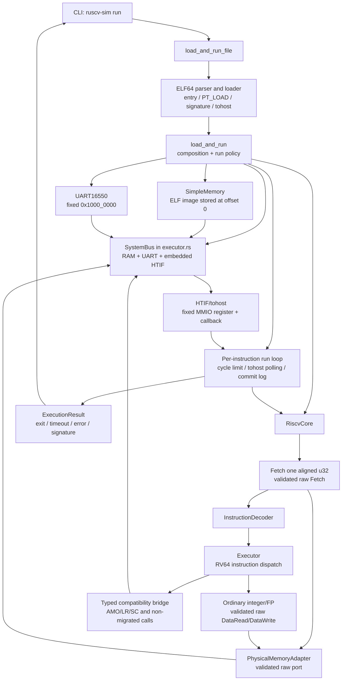
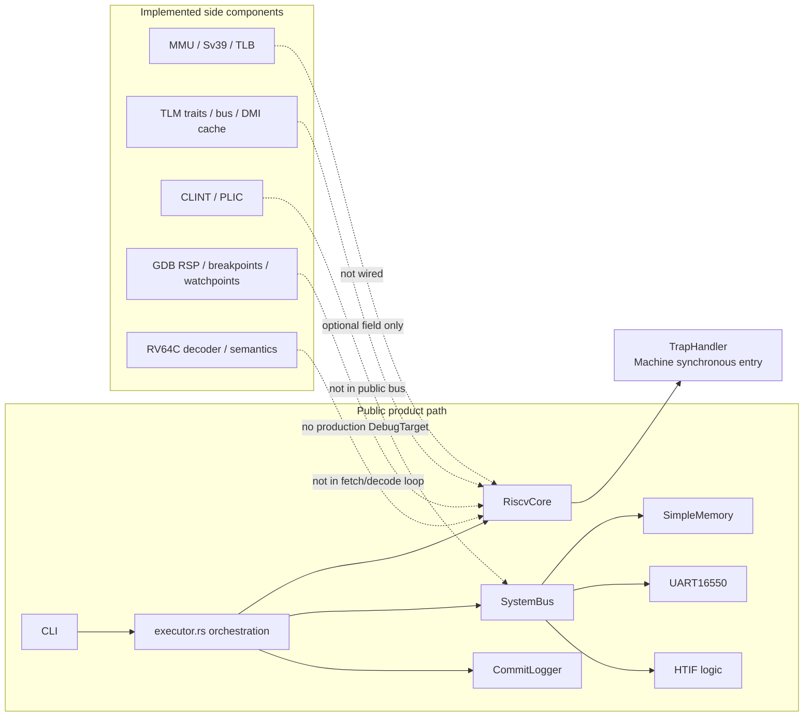

# Current Implementation Architecture

**Status:** Current implementation inventory

**Authority:** Informational

**Last verified:** 2026-09-19 at A7 implementation evidence head `fb6f51c771f32585f1547422c9633379f7ae370b`;
A4 evidence updated 2026-09-11;
A5 selected external evidence reconciled 2026-09-15; A6 Task 4 guest/evidence
verified at source `845c63325db5ac87ab2ff0ed260453dc3b396ae9` (tree equal to
implementation merge `f12b1f80907e92b1c82b33ac669b961cc17f59c9`). See the
[A7 T5 verification record](../verification/a7-capability-assessment.md) for
fresh exact-head Rust, project-ELF, and ACT4 evidence.

**Scope:** The public ELF execution path, adjacent library APIs, and the integration status of existing ISS/VP components

This document describes what the repository implements today. It is deliberately separate from the [target architecture](./README.md): target diagrams define intended ownership, while this inventory records current wiring and boundary debt. Source code and verified tests remain authoritative for implementation claims.

## 1. How to read the status labels

### A5 external compatibility update

At implementation merge `f2edf77f17a76bea3d7062f40f5f4f38ad4eb580`,
[ACT4 CI 34766332271](https://github.com/mimiqdev/ruscv-sim/actions/runs/34766332271)
cleanly generated and passed all **51 frozen nontrapping RV64I self-check ELFs**
through the release public CLI. Standard push CI `34749931575` at the same head
separately compiled and passed **46/46 project-authored guests**.
The [assessment](../verification/a5-capability-assessment.md) records approved
MXLEN test-adapter/natural-alignment decisions, all 1,970 source dispositions,
exact reviews, hashes and negative controls.

[Branch displacement](../../src/isa/rv64i/branch.rs#L1) and
[base-I FENCE](../../src/isa/rv64i/fence.rs#L1) are repaired with public
regressions; [memory bounds](../../tests/memory_bounds.rs#L1) were separately
hardened in PR #36. This does not integrate MMU/PMP, privilege/interrupt scheduling, successful
misalignment, FENCE.I, or the full target Runner/Machine/Platform design. Component
labels below remain component labels. A5 was formally closed out in PR #37 (merged
`d1834cc6566b342824bca30772cc829953a5c5ef`). Its successor A6 is also formally
accepted; [A7 non-atomic physical-access migration](../dev-plan.md) is now the
sole active contract. Its activation record did not claim implementation; the
T5 record below is the current bounded implementation evidence.

A6 Task 2 and Task 3 implementation evidence now covers `exec_mret` privilege
validation/restoration and the integrated public Hart boundary: `RiscvCore::step_outcome`
returns typed `InstructionRetired`, `TrapEntered`, or `SimulatorFailure` facts;
synchronous fetch/decode/execute faults enter Machine-mode traps without retirement;
`minstret` uses explicit-write precedence; and both public runners charge started
slots separately from completed turns while continuing into guest handlers. Task 4
adds five self-checking trap guests, fresh isolated ELF build/run scripts, public
CLI/library integration coverage, and induced-fault transaction assertions. The
full nine-criterion evidence matrix is [`docs/verification/a6-capability-assessment.md`](../verification/a6-capability-assessment.md),
and the formal closeout record is [`docs/archive/milestones/a6-closeout-record.md`](../archive/milestones/a6-closeout-record.md).
PR #46 merged the preparation as `024d15d546dc3b711f593cd44bb107612fd8b600`;
its final PR-head and exact-merge CI are recorded separately from the Task 4 runs.
The maintainer accepted A6 and approved the full [A7 contract](../dev-plan.md)
on 2026-09-18. A7 implementation now migrates fetch and ordinary integer/FP
loads/stores through the validated raw physical boundary in both standard
facades; the T0--T4 records and T5 evidence are bound to implementation head
`fb6f51c771f32585f1547422c9633379f7ae370b`. Legacy AMO/LRSC behavior remains
preserved over shared storage/locking as explicit debt. The T5 record verifies
that bounded non-atomic statement, fresh project ELFs, the fresh pinned ACT4
run, and the pre-/post-migration public-facade memory-loop observation. The
coding-side record is not an independent cumulative review and does not
formally close A7 or alter `.qing/config.toml`. Existing A5 ACT4 results remain
separately scoped nontrapping evidence.

| Label | Meaning |
| --- | --- |
| **Public path** | Reachable through `ruscv-sim run` and exercised as part of the ELF execution flow. |
| **Library path** | Reachable through a public Rust API, but not used by the CLI execution path. |
| **Component** | Implemented and covered by focused tests, but not wired into the public ELF path. |
| **Placeholder** | A type, field, or interface exists, but the execution path does not use it. |

These labels describe integration, not specification completeness. An instruction or subsystem may have unit tests without being verified end to end by an external architectural test suite.

## 2. Public ELF execution path

The flow is real and usable: the CLI loads an RV64 ELF, constructs RAM, UART, and the concrete bus, steps the core, observes `tohost`, optionally writes a commit log, and returns an execution result. Project-authored bare-metal ELF tests are also compiled and run in CI on non-documentation pushes to `main`.

The current composition has several important properties:

- `load_and_run` simultaneously acts as loader, machine builder, runner, stop-policy owner, result builder, and observer coordinator.
- In the two standard facades, fetch and ordinary integer/FP guest accesses
  use separate validated raw ports over shared storage/device locks. The typed
  view remains an intentional compatibility bridge for AMO/LR/SC and host
  inspection; the bridge is not a second ISA engine or a second storage copy.
- `SystemBus` is a concrete platform type in the public `executor` module and is instantiated directly by `load_and_run`; it is not the standalone TLM bus and is not re-exported at the crate root.
- ELF memory is stored relative to its lowest load address. In `load_and_run`,
  `RiscvCore::reset` uses base `0`, so the migrated raw physical adapter
  submits guest addresses unchanged and `SystemBus` converts RAM addresses to
  offsets; the retained typed compatibility/host view is still identity-mapped.
  The alternate flat-memory library path resets with the ELF base and its raw
  adapter performs the one checked base subtraction before reaching flat RAM.
- The core fetches a 32-bit word and advances the PC by four unless execution marks a branch as taken. RV64C decoding exists separately but is not in this fetch path.
- `step_outcome` returns typed `InstructionRetired`, `TrapEntered`, or `SimulatorFailure`; `step` retains `Result<()>` compatibility. Synchronous traps are integrated. Guest exits and limits remain outer `RunControl` decisions; full Machine facts/debug integration is not implemented.
- Native commit logging uses the fetched instruction from the retired fact, not a re-fetch. It still compares Runner-side GPR snapshots and omits memory effects; this is not the full ADR-0001 observation contract (`src/executor.rs`, `tests/public_behavior.rs`).

## 3. Current composition and ownership

This is not yet the target `Frontend → Runner → Machine → Hart/Platform → ports` dependency structure. The main boundary problem is not missing instruction code; it is that product orchestration and a minimal platform are fused while several richer components live beside, rather than behind, the active execution path.

The [A4 assessment](../verification/a4-capability-assessment.md) records the
bounded shared run-control and installation owners for **two public entry loops**,
not `RiscvCore::run`. T3's same-ELF tests combine nonzero entry offsets with
guest data load/store, artifacts, budget/error/exit boundaries and replacement
installation. T3 was independently approved at exact head `810bf839` and merged
as `e47a1b0`; its full gate and merge-time 46/46 separately compiled guest
evidence are recorded in the [A4 closeout](../archive/milestones/a4-closeout-record.md).
Formal closeout and the [historical A5 contract](../archive/milestones/a5-act4-rv64i-external-compatibility.md) were approved by
[PR #31](https://github.com/mimiqdev/ruscv-sim/pull/31), merged as
`a4804341f4ae0a5344beea7ef6c53667e1912c93` on 2026-09-11.
This does not integrate the broader composition or establish
external RV64I compatibility.

## 4. Component integration inventory

| Area | Current implementation | Status | Evidence and limitation |
| --- | --- | --- | --- |
| CLI | One `run` command with ELF path, cycle limit, `tohost`, verbosity, and commit-log options | **Public path** | `src/main.rs` calls `load_and_run_file`; no machine/platform/debug selection exists. |
| ELF loader | ELF64 little-endian RISC-V parsing, load segments, entry point, signature, and `tohost` discovery | **Public path** | Used directly by `load_and_run`; image is flattened relative to `base_addr`. |
| Runner/orchestration | Per-turn loop, started-slot budget, completed-turn count, HTIF polling, signature dump, result construction | **Public path** | Implemented inside `load_and_run`, not as a stable Runner abstraction. Image placement, result construction, run-control decisions and image installation are shared with the library wrapper. `RunControl` reserves a slot before each Hart attempt, counts `InstructionRetired` and `TrapEntered` as completed turns, leaves `SimulatorFailure` out of `ExecutionResult.cycles`, and lets a boundary exit win over final-slot timeout. The owner traverses the configuration's ordered lazy observers (CLI HTIF then RAM; flat RAM only), with the shared RAM decode-before-clear rule. See [A4 T1 evidence](../verification/public-behavior-matrix.md#a4-t1-shared-run-control-evidence) and [`src/executor.rs`](../../src/executor.rs). |
| Hart state and execution | PC, GPRs, privilege, CSR/FPU state, decoder, executor, instruction/data memory handles | **Public path** | `RiscvCore::step_outcome` is the semantic engine and returns one typed `InstructionRetired`, `TrapEntered`, or `SimulatorFailure` boundary; `step` remains a compatibility wrapper. The current profile has synchronous trap continuation but does not sample asynchronous platform interrupt lines. |
| Instruction fetch | One aligned 32-bit memory read per step through the validated raw Fetch port in the two standard facades; typed compatibility fetch remains for old core constructors | **Public path** | PC fall-through is fixed at `+4`; the separate RV64C implementation is not selected. Hart alignment, address conversion, decode, and trap mapping remain Hart-owned. |
| RV64 instruction semantics | RV64I dispatch plus M/A/F/D paths in the active executor; ordinary integer/FP loads and stores use the raw DataRead/DataWrite route, while AMO/LR/SC use the explicit typed legacy bridge | **Public path, coverage varies** | Presence in the dispatcher is not a claim of full extension compliance; the bounded frozen ACT4 nontrapping RV64I selection is externally verified, not all dispatched extensions. Base-I FENCE (`MiscMem` with `funct3 = 0b000`) now decodes and executes as a no-op through `exec_fence`: on this synchronous single-Hart `MemoryInterface` with no cache, store buffer or reordering, every prior memory effect is already globally visible before the next instruction issues, so `FENCE` (every `pred`/`succ`/`fm` shape, including `FENCE.TSO` and HINTs) only needs to let the PC advance. `rs1`/`rd` are ignored per the base-I reserved-field rule. `FENCE.I` (Zifencei, `funct3 = 0b001`) remains `DecodeError::UnimplementedInstruction` and a simulator failure; other nonzero `MiscMem` `funct3` values are reserved in the active profile and now enter an illegal-instruction trap (`src/decode/mod.rs`, `tests/a6_task3_core_trap_test.rs`); see [gap G-14](../verification/public-behavior-gaps.md#g-14--base-i-fence-miscmem-funct3--0b000-was-unconditionally-rejected). |
| AMO / LR/SC | Active dispatcher calls ordinary read/write helpers; LR/SC reservation is process-global | **Public dispatch, incomplete contract** | `src/execute/mod.rs::execute_amo` has encoding/width debt; `src/isa/rv64a/amo.rs` uses word read then word write, and `lr_sc.rs` uses `GLOBAL_RESERVATION` without ordinary-store invalidation. Helper arithmetic tests and A6 atomic-fault tests do not prove ADR-0002 atomicity or A-extension compliance. The approved A7 contract excludes atomic repair/envelopes and preserves existing atomic behavior over shared storage as explicit legacy debt. Ordinary stores currently do not invalidate the global reservation; A7 must not introduce partial invalidation or duplicate state. This is not ADR-0002 atomic conformance. |
| Flat memory | Thread-safe byte vector with typed aligned accesses | **Public path** | Also used directly by the alternate library simulator path. |
| Native bus | Concrete typed RAM/UART/HTIF routing plus raw backend views in `executor.rs`/`physical.rs` | **Public raw path for standard facades; typed compatibility path retained** | `SystemBus` is public through `ruscv_sim::executor`, with fixed devices and limited typed access widths. `NativeSystemBusBackend` wraps the caller's shared `Arc<Mutex<SystemBus>>` and applies full-span raw routing without copying targets. Its UART route spans `0x1000_0000..0x1000_00ff` (`uart_size = 0x100`), while the exported `UART_SIZE` is 8 bytes. `load_and_run` now installs separate validated raw fetch/data views over this shared domain; old typed methods remain for host inspection and legacy atomics. |
| UART16550 | Register model and raw native target view with output callback | **Public path for ordinary Hart accesses; typed host/legacy path retained** | The public bus and raw adapter expose byte accesses at `0x1000_0000` through a 0x100-byte window, while the UART model declares `UART_SIZE = 8` and a TLM range ending at `0x1000_0007`; offsets `0x08..0xff` retain reserved zero/ignored behavior. The raw adapter rejects Fetch and non-byte spans before touching FIFO/status/output state. The richer TLM target behavior is tested separately. |
| HTIF / `tohost` | Fixed typed write endpoint, callback, selected-address polling, exit decoding, RAM clearing, and raw exact-endpoint view | **Public raw guest path plus typed host/legacy path** | The fixed `0x4000_8000` typed endpoint remains dword-only and start-address-only for compatibility: `read_dword` returns `0`, `write_dword` invokes the callback, including interior starts, and byte/halfword/word methods reject it. The raw view validates the complete eight-byte endpoint, rejects interior/Fetch requests without a callback, and invokes one callback on a successful raw write. Separately, runner polling, clearing, and artifact extraction remain typed host observations; legacy SC width behavior remains on the typed bridge. |
| Commit trace | Optional per-retired-instruction record | **Public path** | The native runner logs only `InstructionRetired` facts supplied by the Hart, including the fetched instruction and privilege; trap and failure boundaries produce no commit. `mem_access` remains `None` in the existing logger format. |
| `RiscVSimulator` wrapper | Flat-memory load/step/run API | **Library path** | Its run loop remains its own, but image installation, placement resolution, result construction and the run-control decision are shared with `load_and_run`; it does not use `SystemBus`, so it has no UART/HTIF device mapping. Its flat addresses remain storage offsets. Both entry points now resolve image-declared `tohost`/`.signature` metadata through one internal placement owner that expresses the two address forms: the bus configuration passes guest addresses through, the flat configuration converts them with checked arithmetic. The conversion is storage adaptation, not guest virtual-to-physical translation, and grants no device ability. It must not become a second architecture engine. |
| Cached instruction dispatcher | `Dispatcher`, instruction-key lookup, and LRU cache | **Component** | `src/dispatch/mod.rs` defines `Dispatcher`; focused tests cover registration and cache behavior, but `RiscvCore` owns and calls `Executor` directly, so this dispatcher is not in the active execution path. |
| Code-generation experiments | Encoding templates and procedural-macro experiments | **Component / placeholder** | They are not the active decoder or executor; some macro expansions target APIs absent from the current core. See [Code-Generation Component Status](../reference/code-generation.md). |
| Trap model | Causes, Machine-mode entry, typed Hart outcomes, delegation component, MRET semantics, and A6 guest/fault verification | **Public path (A6 formally accepted)** | `src/core/trap.rs` and `src/isa/rv64i/system.rs` provide cause/vector/CSR entry and MRET restoration. `RiscvCore::step_outcome` stages trap entry and maps fetch, decode, alignment, execution, and physical-access failures to `TrapEntered` or `SimulatorFailure`; successful instructions produce `InstructionRetired` with `minstret` facts. `src/executor.rs` consumes the boundary with continue-to-guest-handler policy and started-slot/completed-turn accounting. `tests/trap_test.rs` adds genuine induced-fault/transaction assertions; `tests/a6_trap_elf_integration.rs` and the fresh scripts exercise public CLI and library facades when the cross-toolchain is available. See the bounded [A6 evidence matrix](../verification/a6-capability-assessment.md); no asynchronous interrupt, MMU, compressed-instruction, or ACT4 extension claim follows. |
| MMU / Sv39 / TLB | Sv39 page-table translation, TLB, A/D behavior, and physical-memory model; Sv48 is recognized as a mode but rejected as unsupported, while PMP configuration/error placeholders exist without checks | **Component** | Focused tests cover the Sv39 path, but no MMU is owned or called by `RiscvCore`; the public ELF path uses ELF base adaptation instead. `MmuConfig::enable_sv48` and `pmp_entries` are configuration fields, and `MmuError::PmpViolation` exists, but the translator rejects Sv48 and no PMP check is implemented in `Mmu` or `AddressTranslator`. |
| TLM | Payloads, phases, target/initiator traits, routed bus, simple memory, DMI cache | **Component** | Tested as a Rust TLM-style subsystem. The optional `RiscvCore::tlm_interface` field can be set but is not read by `step`; no SystemC/C++ adapter exists. |
| CLINT / PLIC | MMIO models, interrupt state, TLM target implementations | **Component** | Unit/integration tests compose them with `TlmBus`, but the public `SystemBus` does not map them and the Hart has no interrupt-line input. |
| Debug | GDB RSP server, debug CLI, breakpoint and watchpoint managers | **Component** | Production code defines the `DebugTarget` contract, but only mock targets implement it; the product CLI does not expose a debug mode. |
| Platform time | TLM-style `ScTime` and CLINT time functions | **Component** | Public `ExecutionResult.cycles` counts completed Hart turns, including synchronous trap entry, not only retired instructions. Started slots and `minstret` remain separate. No scheduler/device-time advancement is integrated. |

## 5. Current → Target gap matrix

| Target boundary | Current mapping | Gap that must be resolved before implementation planning |
| --- | --- | --- |
| Frontend | `src/main.rs` directly calls `load_and_run_file` | Introduce a frontend-facing application API without exposing concrete machine internals or embedding presentation in the runner. |
| Loader | `elf.rs` parses and flattens the image; `load_and_run` places it | Define a load-image contract that places segments through Machine/Platform ownership and does not masquerade as address translation. |
| Runner | Separate loops in `load_and_run` and `RiscVSimulator` use shared `RunControl` decisions and result construction | The bounded current continue/guest-exit/timeout/execution-error rule is shared; typed synchronous Hart outcomes are integrated; full Runner/Machine/Platform composition, debug stops and generalized non-lossy fact handling remain unintegrated. The [A4 closeout](../archive/milestones/a4-closeout-record.md) records integrated tests, exact-head review and successful final merge CI; formal closeout was approved in PR #31. |
| Machine | No explicit type composes Hart and Platform | Define the composition/lifecycle boundary while preserving one `RiscvCore` semantics implementation. |
| Hart | `RiscvCore` owns active state/decode/execute but also ELF-base address adaptation and concrete memory traits | Move storage-offset adaptation below the physical boundary and depend on approved architectural ports; preserve the existing typed synchronous step outcomes. |
| Retirement/observation | `load_and_run` logs only retired Hart facts, with Hart-fetched opcode/privilege; Runner GPR snapshots and absent memory effects remain | Preserve current no-refetch behavior; full Hart-owned effect records and subscriber-gated observation remain future work, not a missing synchronous trap outcome. |
| Physical access | `src/physical.rs` is the validated non-atomic vocabulary; both standard facades install separate raw Fetch/DataRead/DataWrite views over shared RAM/device storage, while AMO/LR/SC retain the typed legacy bridge | The ordinary migration is verified, but universal ADR-0002 convergence is not: atomic envelopes, Hart-owned reservation semantics, multi-writer coherence, and broader Machine/Platform composition remain future scope. The legacy bridge must retain its explicit lock/address-key boundary without re-entering the outer data-memory lock. |
| Platform/address map | `SystemBus` is a fixed RAM/UART/HTIF switch inside `executor.rs`; `TlmBus` is separate | Choose one platform address-space abstraction with native and future TLM backends, without routing ISA semantics through two buses. |
| MMU | Standalone `mmu` subsystem is not called by the core | Decide how Hart-owned instruction/data translation uses the same physical-access port as normal accesses and page-table walks. |
| Traps and interrupts | A6 synchronous Machine traps are integrated through `step_outcome`; asynchronous line sampling remains absent | Define Platform source/input admission and Machine grants at Hart/profile-provided architectural boundaries; keep eligibility, masking, delegation, architectural priority, trap/debug/WFI transitions, and ISA-visible counter deltas in the Hart/profile. |
| Devices | UART is minimally wired; CLINT/PLIC are TLM-side components; HTIF is embedded in the executor bus | Define device lifecycle, reset, MMIO routing, interrupt output, host service, and platform-exit contracts. |
| Time/scheduling | Public execution counts completed turns and started slots separately; side components have independent time concepts | Implement the accepted minimal ISS time/budget contract in [ADR-0004](decisions/0004-interrupt-time-scheduling-and-stop-boundaries.md) so it can later be driven by a VP scheduler without changing Hart semantics. |
| Debug/run control | GDB and managers exist only against mock `DebugTarget` implementations | Bind debug operations to Machine/Runner state and distinguish debugger stops from traps, exits, limits, and faults. |
| TLM/SystemC | Rust TLM-style components and an unused optional core field exist | Make TLM a `PhysicalAccess` adapter. Define a narrow C/C++ boundary later; do not add a TLM-specific Hart execution path. |
| Faster execution | Only single-instruction interpretation is active | Preserve precise retirement and event contracts so block execution, translation, DMI, and temporal decoupling can be added as strategies later. |

## 6. Boundary debt to address first

ADR-0001–0004 already define these semantic boundaries. Remaining implementation
debt is not a new architecture-decision backlog or an approved sequence:

1. Complete Hart-owned observation effects beyond the existing typed A6 outcomes.
2. Complete public physical-access convergence under ADR-0002, including atomic envelopes, explicit capability/reservation boundaries, and multi-writer semantics; A7's ordinary route is complete but its legacy atomic bridge remains.
3. Separate broader Machine/Platform/Runner composition beyond shared installation and run control.
4. Implement interrupt/time/debug boundaries only under separately approved scope.
5. Adapt MMU/TLM/peripheral/debug components before wiring them; component tests alone do not establish adapter conformance.

## 7. Behavior that refactoring must preserve

- One shared architectural execution engine for standalone ISS and future VP forms.
- The current CLI ELF flow and its cycle-limit override.
- ELF segment, entry-point, `tohost`, and signature discovery behavior that is covered by tests.
- Project-authored bare-metal ELF execution in CI.
- UART output and HTIF exit behavior on the public path until deliberately replaced by approved platform contracts.
- Existing focused tests as component-level regression protection, without relabeling them as end-to-end support.

## 8. Explicit non-claims

This inventory does not claim that:

- Full RV64I/M/A/F/D/C, privilege, or trap behavior is externally certified. The frozen 51-case nontrapping RV64I baseline and A7 ordinary physical-access evidence are bounded exceptions, not whole-extension or atomic certification.
- MMU, CLINT, PLIC, GDB, or TLM is integrated into public ELF execution.
- the Rust TLM-style API is a SystemC-compatible adapter.
- the current fixed 32-bit fetch policy is the intended final ISA boundary.
- component tests constitute a bootable full-system machine or Virtual Platform.
- A7 is formally closed; the T5 record is bounded evidence and the active milestone contract remains in place.
