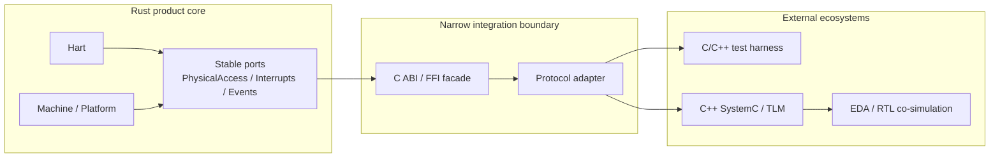

# Integration Boundaries

**Status:** Current target boundary

**Authority:** Normative

**Last reviewed:** 2026-08-26

## Principle

External integration must adapt to stable simulator ports. It must not inject SystemC, vendor APIs, or test-framework types into Hart semantics.

## Integration categories

- Validation toolchains build guest ELFs and drive the public Runner.
- Native platform components implement Rust ports directly.
- SystemC/TLM integration translates physical transactions, interrupts, time, and events at an FFI boundary.
- Debuggers and automation use frontend APIs and observation events.

See [SystemC/TLM boundary](systemc-tlm.md).
