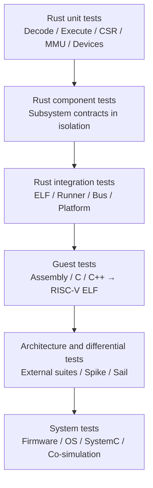

# Verification Architecture

**Status:** Current

**Authority:** Normative for test-layer ownership; individual tool integrations require their own verified setup

**Last reviewed:** 2026-09-19

## Test layers

Passing a lower layer does not imply a higher layer is integrated. In particular, a component test for an ISA extension, MMU, peripheral, or TLM object is not an end-to-end product-support claim.

## Language policy

Test language follows the layer rather than the simulator implementation language:

| Layer | Expected languages |
| --- | --- |
| Simulator unit/component/integration | Rust, plus property-test and benchmark crates |
| Guest program | RISC-V assembly, C, or C++ |
| External architecture suite | Whatever the upstream suite and toolchain require |
| Orchestration and comparison | Rust, Python, shell, or upstream tooling |
| SystemC/TLM and EDA integration | C++ plus any vendor-required languages |

## Current repository inventory

- Rust tests live under `src/**` and `tests/*.rs`.
- Project-authored guest programs currently live under `tests/bare-metal-riscv-test/` and are assembly sources.
- CI installs a RISC-V GNU assembler/linker, runs all Rust tests, and on pushes to `main` builds and runs the project-authored ELF programs.
- Commit-log comparison helpers exist, but the log currently omits memory-access records in the public ELF run loop.
- No external RISC-V architecture suite is treated as integrated merely because documentation mentions it.

## Verification documents

- [A1 acceptance and closeout](a1-acceptance-assessment.md) — completed baseline, explicit limitations and the bounded A2 handoff
- [A2 acceptance and closeout](a2-capability-assessment.md) — completed flat-library workflow, explicit limitations and the A3 handoff
- [A3 acceptance and closeout](a3-capability-assessment.md) — completed shared placement and result construction, explicit limitations and the A4 handoff
- [A4 acceptance and closeout](a4-capability-assessment.md) — shared run control and installation; closeout and A5 contract approved in PR #31
- [A5 capability assessment and closeout](a5-capability-assessment.md) — approved frozen profile, final 51/51 selected external passes and negative controls; formally closed out in PR #37
- [A1 public behavior compatibility matrix](public-behavior-matrix.md) — CLI/ELF and flat-library inventory plus persistent second-batch tests
- [A1 public behavior defect and gap register](public-behavior-gaps.md) — bounded reproductions and unverified limits
- [Project-authored bare-metal tests](bare-metal-tests.md)
- [A6 capability and acceptance assessment](a6-capability-assessment.md)
- [A6 retained A5 ACT4 replay summary](a6-act4-replay-35325844246.json)
- [A7 T1 non-atomic physical contract](a7-physical-contract.md) — vocabulary and focused validation boundary; not native/Hart integration
- [A7 T2 native target adapters](a7-native-targets.md) — shared native RAM/UART/HTIF component adapters; not Hart/public-facade migration
- [A7 T3 Hart physical wiring and legacy bridge](a7-hart-physical.md) — ordinary Hart routes, lock order, and retained legacy atomic boundary
- [A7 T4 public-facade equivalence](a7-public-equivalence.md) — CLI/library workflow matrix, route audit, and bounded compatibility exceptions
- [A7 T5 final verification and bounded closeout evidence](a7-capability-assessment.md) — §8 matrix, exact-head Rust/ELF/ACT4 evidence, cumulative independent review outcome, residual debt, and explicit rolling-transition boundary
- [A7 bounded closeout record](../archive/milestones/a7-closeout-record.md) — six-item acceptance, PR/source identities, two independent 51-case scopes, replay/tool limits, and next-roadmap boundary
- [A7 ACT4 offline replay](a7-act4-replay-35432032788.json) — compact digest-bound replay of the fresh 51-case artifact
- [A7 performance observation](a7-performance-observation.json) — bounded current-head Criterion observations; no regression claim
- [A7 public-facade physical-loop observation](a7-physical-loop-observation.json) — pre-migration/current public `load_and_run` measurements with guest-result and retirement checks
- [A7 cumulative T5 review checklist](a7-t5-cumulative-review-checklist.md) — source/test dependencies and independent-review boundary for the final PR head
- [External RISC-V test integration contract](external-riscv-tests.md)
- [Commit tracing and differential testing](commit-tracing.md)

The A1 matrix and gap register are current as-of evidence records, not an A1
closeout and not a claim that component tests or old CI/reference logs prove
public-path support. The A7 closeout record is bounded to the non-atomic
migration; it does not replace the sole current `docs/dev-plan.md` contract or
select a successor milestone. The matrix records the exact revision, the initial host
limitation, and the successful Docker-based guest evidence for its batch.
The [A1 closeout](../archive/milestones/a1-closeout-record.md) additionally records
exact-merge main CI with guest compilation and 46/46 execution; historical
batch observations are not rewritten as new runs.

Historical test proposals are retained under [`../archive/designs/`](../archive/designs/).
