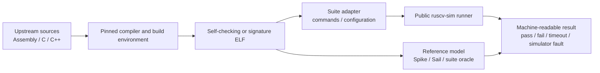

# External RISC-V Test Integration Contract

**Status:** Draft architecture contract

**Authority:** Normative boundary; no suite is currently claimed as integrated by this document

**Last reviewed:** 2026-08-26

## Purpose

External tests must exercise the same public execution path used by product users. They must not call instruction implementation functions directly or rely on a separate test-only Hart.

## Boundary

The validation toolchain may contain C++, C, assembly, Python, Ruby, shell, or other upstream-required languages. That does not move guest ISA semantics out of the Rust Hart.

## Required properties before claiming integration

- Upstream source and tool versions are pinned.
- Build and execution commands are reproducible locally and in CI.
- DUT capability configuration describes only the public execution path.
- Guest failure, timeout, unsupported behavior, and simulator fault have distinct results.
- Every simulator defect found by the suite receives a focused local regression.
- Artifacts needed to reproduce failures are retained.
- Selected tests and exclusions are explicit and machine-readable.

## Naming

“RISC-V tests” is ambiguous. A concrete milestone must name the exact upstream repository, branch or specification framework, revision, selection, reference model, and compiler environment.
