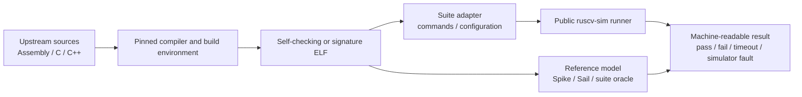

# External RISC-V Test Integration Contract

**Status:** Current external-test boundary and selected integration evidence

**Authority:** Normative boundary; A5 evidence is limited to its frozen selection

**Last reviewed:** 2026-09-15

## Purpose

External tests must exercise the same public execution path used by product users. They must not call instruction implementation functions directly or rely on a separate test-only Hart.

## Boundary

The validation toolchain may contain C++, C, assembly, Python, Ruby, shell, or other upstream-required languages. That does not move guest ISA semantics out of the Rust Hart.

## Required properties before claiming integration

- Upstream source and tool versions are pinned.
- Build and execution commands are reproducible locally and in CI.
- DUT capability configuration describes only the public execution path.
- Guest failure, timeout, unsupported behavior, and simulator fault have distinct results.
- Every simulator defect found by the suite receives a focused local regression.
- Artifacts needed to reproduce failures are retained.
- Selected tests and exclusions are explicit and machine-readable.

## Naming

“RISC-V tests” is ambiguous. A concrete milestone must name the exact upstream repository, branch or specification framework, revision, selection, reference model, and compiler environment.

The [A5 contract](../dev-plan.md) selects ACT4 4.0.0 at
`a7c99303516f4e668f7488f172043392e23b9dfd`, Sail-derived self-check ELFs and
the public release CLI. The [frozen decision record](a5-selection-proposal.md#final-decision-and-evidence)
records explicit 2026-09-15 approval of the MXLEN provenance test adapter and
naturally aligned EEI. It accounts for 1,970 sources: **51 required + 8
successful-misalignment exclusions + 654 other-extension + 355 privileged-purpose
+ 902 other-base-profile**.

[Final ACT4 CI](https://github.com/mimiqdev/ruscv-sim/actions/runs/34766332271)
at `f2edf77f17a76bea3d7062f40f5f4f38ad4eb580` generated/executed/passed all
51 selected ELFs with negative controls. [Final evidence](a5-final-results.json)
and the [closeout](../archive/milestones/a5-closeout-record.md) give exact
hashes, per-test results, source accounting, review and retention. The run
preceded formal profile approval but used identical semantic inputs; approval
metadata alone is not a reason to regenerate.

## Reproduce or retrieve A5 evidence

The [feasibility setup](a5-feasibility.md) documents pinned workspace-local
Linux tools and unsuccessful attempts. The reproducible full-selection command
is `A5_SELECTION=proposal bash scripts/a5/experiment.sh`; the historical mode
name selects the now-frozen profile, not an unapproved subset. The
[manual workflow](../../.github/workflows/a5-feasibility.yml#L1) runs that mode,
with a 30-minute job bound and 14-day artifact retention. Each DUT invocation has
1,000,000-cycle and 60-second host bounds. Do not substitute Cargo tests,
signature-input ELFs or cached unexplained binaries for this workflow.

For existing evidence, prefer the
[hash-verified final artifact replay](../archive/milestones/a5-closeout-record.md#retrieval-and-durable-evidence)
instead of a new generation run. This verifies historical hashes and outcomes,
not new guest execution. A5 is formally closed out (PR #37 merged `d1834cc6566b342824bca30772cc829953a5c5ef`).

This is **selected external compatibility**, not whole RV64I certification,
successful-misalignment/trap support, MMU/privilege integration, or a complete
machine configuration. The original feasibility and failed-run reports remain
historical evidence; their pending profile statements are superseded by approval.
